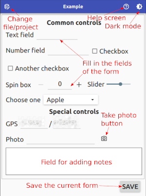

# Annotation

Advanced annotation tool for agricultural field work.

[image]

**Features**

- Cross platform  
  - Full support for Android, iOS, Windows, Linux, MacOS
  - Provided executables for Windows and Android
- Fully configurable user interface (see [Creating forms](creating_forms.md) for details)
- Project-specific form
- Multi-language (English and French currently)
- Dark theme (for reduced power consumption on *oled* screens)
- Easy access to the database (CSV format)
- Georeferenced data
- Free and open source (see [License](LICENSE) for details)

## Useage

**Please read the instructions below before using the application!**

The app has a fully configurable interface, that can be adapted for your project.

1. Before using the app, you **must** create a form adapted for your needs. See the [Creating forms](creating_forms.md) document or the provided example files. Copy the created `.ui` file to the `Documents/annotation_forms` folder on your device (your computer or tablet). You might need to create this folder. 

2. On startup, create a new project by specifying the **file name**, **project** and selecting the **desired form** from the dropdown list. 
   
   You can also select an existing file to continue with the same project.

3. Now, the selected form appears, and you can start to add data to the file.
   
   

The file can be found in the `Documents/annotation` folder of your device as `.ant` files; the images are in the `Pictures` or `DCIM` folder (using filename format `annot_[date]_[time].jpg`).

The data is stored as TAB delimited text, so it can be imported to Excel, QGis or a Python script.

## Build instructions

These are the instructions if you want to build the application for yourself.

**Prerequisites**

- Build tools [^1]
- Qt development libraries (5.12+) [^2]
- QtQuick2 development libraries [^2]
- [Optional] Qt Creator [^2]
- [Optional] Android or iOS Development Kit [^3]

[^1]: *mingw* for Windows, *build-essential* package for Linux/MacOS. MinGW can be installed using the QT online installer (see below).
[^2]: easiest way to install is through the [Qt online installer](https://www.qt.io/download)
[^3]: see configuring Qt for [Android](https://doc.qt.io/qt-5/android-getting-started.html) or [iOS](https://doc.qt.io/qt-5/ios.html)

**Building**

```
git clone ...
cd Annotation
mkdir build
cd build
qmake ../Annotation.pro
make
```

...or open the Annotation.pro project in QtCreator and press "Build".
