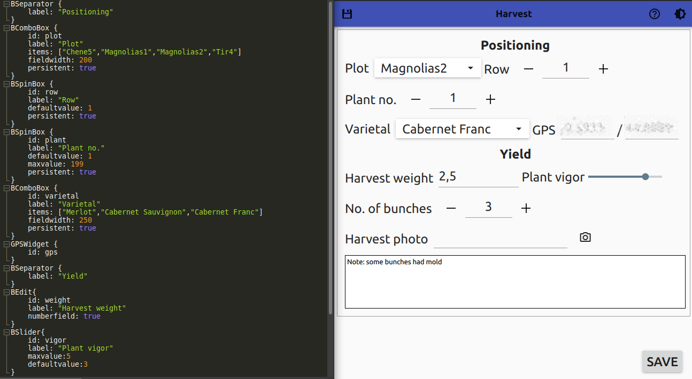

# Creating forms

The interface of the *Annotation* app is fully configurable that can be adapted it to any project.

The forms are defined in `.ui` text files which have to be in the `Documents/annotation_forms/` folder of the device.



These files can be created using any text editor.

Some example forms can be found in the `examples` folder.

## Creating user forms

The controls have the following syntax:

    Control_type {
        parameter: value
        other_parameter: value
    }

There are three parameters, which are common for most controls:

- `id`: this is the ***unique*** identifier of the control. This parameter ***must*** be defined for all contols, except `BSeparator`. It consists in one word, beginning with a lowercase letter.

- `label`: the label displayed with the control (all, except `GPSWidget`). It has to be enclosed in quotation marks.

- `persistent`: if this is set to `true`, the control will keep its value after the data is saved; otherwise it resets to the default value (all the input controls)

### Control types

**BEdit**: a text/number field.

Parameters:

- `id` - unique identifier
- `label` - label to be shown near the control
- `persistent` - set to `true` to keep the value of the control after saving the data
- `fieldwidth` - sets the width of the text field
- `numberfield` - set to `true` to accept only numbers. This also sets the on-screen keyboard to numeric.

**BSpinBox**: a number field with +/- buttons to change its value.

Parameters:

- `id` - unique identifier
- `label` - label to be shown near the control
- `persistent` - set to `true` to keep the value of the control
- `autoincrement` - set to `true` to increment the value of the control after saving a data
- `defaultvalue` - the initial value of the control. When the spinbox is reset, it will take this value again.
- `maxvalue` - the upper limit of the value

**BSlider**: a slider. The parameters are similar to `BSpinBox`.

Parameters:

- `id` - unique identifier
- `label` - label to be shown near the control
- `persistent` - set to `true` to keep the value of the control
- `defaultvalue` - the initial value of the control. When the spinbox is reset, it will take this value again.
- `maxvalue` - the upper limit of the value
- `fieldwidth` - sets the length of the slider

**BCheckBox**: a check box

Parameters:

- `id` - unique identifier
- `label` - label of the check box
- `persistent` - set to `true` to keep the value of the control

**BComboBox**: a control with selectable values

Parameters:

- `id` - unique identifier
- `label` - label to be shown near the combo box
- `persistent` - set to `true` to keep the value of the control
- `items` - the list of the items of the control in format: `["Item1","Item2",...]`
- `fieldwidth` - sets the width of the combo box field

**BSeparator**: Adds a separator with a title to the interface. Useful for grouping controls

Parameters:

- `label` - title of the next group

*Note:* Do not set an `id` for a `BSeparator` control!

**GPSWidget**: shows the GPS coordinates. Use this to add georeferencing to the data.

Parameters:

- `id` - unique identifier

*Note:* Do not assign a label to the `GPSWidget` control!

**CameraWidget**: a widget to take a photo. The photo will be saved to the pictures folder (e.g. `DCIM` on mobile devices) with file name `annot_[date]_[time].jpg`

Parameters:

- `id` - unique identifier

You can also add **comments** to a UI file in lines beginning with `//`, like in C/C++.

## Troubleshooting

- If you cannot see the `ui` file in the dropdown list, make sure that it is in the `Documents/annotation_forms` folder of your device.

- If you see an empty form, it means that something is wrong with your `ui` file. Try to remove some controls until you get a working form, and check the removed controls for errors.
  
  - Make sure that each `id` is unique! The `id` should be one word, beginning with a letter.
  
  - The parameters are always lowercase and case sensitive; they are followed by `:`! (`label :` is correct; `Label =` is incorrect)
  
  - Strings (e.g. for `label`) are enclosed in quotation marks. Other values (like `id`) are without quotation marks. See example below:
    
    ```
    BCheckbox {
        id: mycheckbox //no quotation mark
        label: "Check box" //quotation mark
        persistent: true //no quotation mark
    }
    ```
    
    