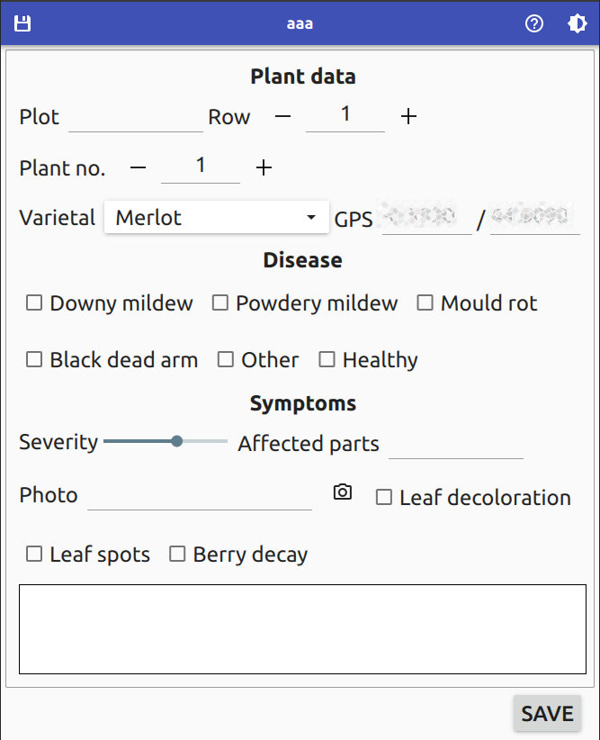

Annotation example files
========================

This folder contains some example forms for the Annotation app. You can use these examples as a starting point to create your own form.

To use a form, copy it to the Documents folder of your device; then select it when creating a new file.

Some screenshots
----------------

`example.ui` - a form showcasing different controls

`disease.ui` - a form for disease annotation

